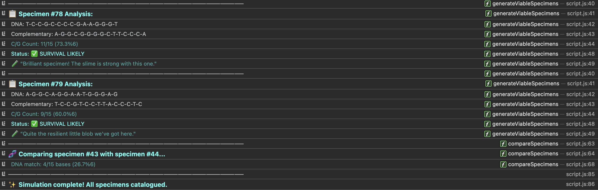

# 🧬 P. aequor DNA Analysis Terminal

A terminal-style interface for analysing the DNA of P. aequor, a mysterious deep-sea organism discovered near hydrothermal vents.

*This project was completed as part of the Codecademy Full Stack Career Path.*

---


*The full terminal interface in action – minimalist, sci-fi, and all in your browser console!*

---

## 🔬 Project Overview

This simulation tool helps researchers study P. aequor by:
- Generating viable specimen DNA sequences
- Analysing survival probability based on C/G base content
- Comparing DNA similarities between specimens
- Generating complementary DNA strands
- Simulating DNA mutations

---


*Sample output showing DNA strands, survival status, and lab commentary – all in a friendly, readable format.*

---

## 🚀 Quick Start

1. Open `index.html` in a modern web browser
2. Press F12 or right-click → Inspect to open Developer Tools
3. Select the Console tab
4. Watch the simulation run automatically!

---


*Landing prompt – just open your console to get started!*

---

## 💻 Technical Details

### Project Structure
```
deepcode-terminal/
├── index.html          # Entry point
├── src/
│   ├── css/
│   │   └── style.css     # Terminal styling
│   ├── js/
│   │   ├── script.js     # Simulation controller
│   │   └── pAequorFactory.js  # DNA logic
│   └── images/
│       ├── fullview.png   # Screenshots
│       ├── coderesults.png
│       └── landing.png
├── LICENSE             # MIT License
├── USER_GUIDE.md      # Lab-style guide
└── README.md          # Technical guide
```

---

## 📄 License

MIT License
Copyright (c) 2025 Tom Butler
This project is part of the Codecademy Full Stack Career Path.

---

### Core Functions

- `pAequorFactory(specimenNum, dna)`: Creates new P. aequor specimens
- `.mutate()`: Simulates DNA mutation
- `.compareDNA()`: Compares DNA sequences
- `.willLikelySurvive()`: Analyses survival probability
- `.complementStrand()`: Generates complementary DNA

### Styling

The project uses a minimalist terminal aesthetic with:
- Dark background for reduced eye strain
- Monospace fonts for code-like appearance
- Cyan accents for key information
- Emoji for visual interest
- Clear hierarchy in console output

## 🔧 Development

### Prerequisites
- Modern web browser with ES6+ support
- No build tools or dependencies required

### Local Development
1. Clone the repository
2. Open `index.html` in your browser
3. Edit code and refresh to see changes

### Adding Features
- Add new methods to `pAequorFactory.js`
- Update console styling in `script.js`
- Modify terminal aesthetics in `style.css`

## 📝 Notes

- All text uses UK English spelling
- Console messages use a friendly, scientific tone
- Code is thoroughly commented for learning purposes
- The simulation auto-runs on page load

## 🎯 Future Ideas

- Add more DNA analysis methods
- Implement evolutionary simulations
- Add visual DNA strand representations
- Create interactive terminal commands
- Add export functionality for research data

## 📜 License

MIT License
Copyright (c) 2025 Tom Butler
This project is part of the Codecademy Front-End Engineer course.
