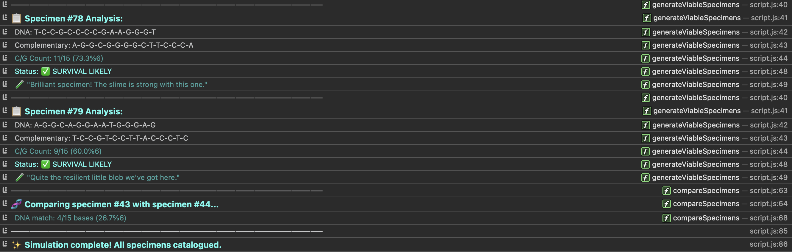

# 🧬 P. aequor Lab Guide

Hello there, lab assistant! Welcome to the fascinating world of P. aequor research.

## What on earth is P. aequor?

P. aequor (pronounced "pee-ack-wor") is a rather peculiar single-celled organism we've discovered in the deepest parts of the ocean, near hydrothermal vents. What makes these little blobs so special is their remarkable DNA structure and ability to survive in extreme conditions.



## What does this tool do?

This simulation helps us study these mysterious organisms without having to don a wetsuit and dive 3,000 metres below sea level (much more comfortable, isn't it?).

With this tool, you can:
- Generate specimens with unique DNA sequences
- See which ones are likely to survive in various environments
- Compare how similar different specimens are to each other
- Watch what happens when DNA mutates
- Create complementary DNA strands (like mirror images of the original)

## How do I use it?

It's quite simple, even if you're not a computer whizz:

1. Open the `index.html` file in any web browser
2. Press the F12 key (or right-click and select "Inspect")
3. Click on the "Console" tab at the top of the panel that appears
4. Watch the magic happen!

The simulation will automatically run and show you 30 different P. aequor specimens, all with their own unique DNA patterns.

## Understanding what you're seeing

When you look at the console, you'll see something like this:

```
> Generating viable specimen #3...
  DNA:   🅰️-🌊-🦠-🌱-🦠-🌊-🅰️-🦠-🦠-🌊-🌱-🦠-🅰️-🌊-🦠
  Comp:  🌱-🦠-🌊-🅰️-🌊-🦠-🌱-🌊-🌊-🦠-🅰️-🌊-🌱-🦠-🌊
  C/G Count: 10 / 15 (66.7%)
  Status: ✅ SURVIVAL LIKELY
  🧪 "A marvel of ooze engineering!"
```

Here's what it all means:

- **Specimen #3**: Just an ID number so we can keep track
- **DNA**: The actual DNA sequence of the organism (A, T, C, G are the four bases that make up DNA)
  - 🅰️ = Adenine (A)
  - 🌱 = Thymine (T)
  - 🌊 = Cytosine (C)
  - 🦠 = Guanine (G)
- **Comp**: The complementary strand (A pairs with T, C pairs with G)
- **C/G Count**: How many C and G bases are in the DNA (important for survival)
- **Status**: Whether this specimen is likely to survive in the wild
- **Comment**: A cheeky observation from our lab team

## Why do some survive and others don't?

In our research, we've discovered that P. aequor specimens need at least 60% of their DNA to be made up of C or G bases to survive. Those with less than 60% C/G content simply don't make it in the harsh deep-sea environment.

## Can I play around with it?

Absolutely! If you're feeling adventurous, you can try these commands in the console:

- `generateSpecimen(42)` - Creates a new specimen with ID #42
- `mutateSpecimen(7)` - Causes specimen #7 to undergo a random mutation
- `compareTwo(3, 12)` - Compares the DNA of specimens #3 and #12 to see how similar they are

## Questions?

If you have any questions about P. aequor or how to use this tool, just ask any of our lab technicians. We're a friendly bunch and don't bite (unlike some of our specimens).

Happy researching!

*-- The P. aequor Research Team*
